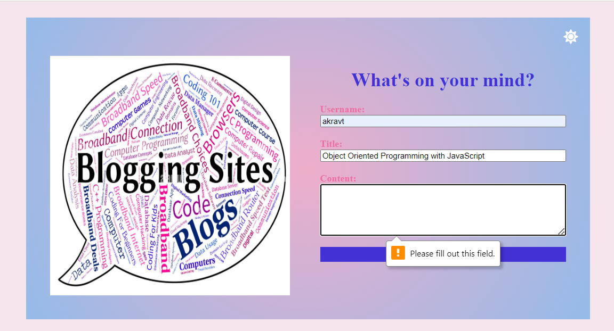

# Personal Blog

## Task

In this Challenge I created a two-page blog site where users can input and view blog posts. It included building a content form, dynamically rendering blog posts, and implementing a light/dark mode toggle.

## Screenshots
The landing page containing a form with labels and inputs for username, title and content:

Message that prompts to complete the form when submitting a form without a username, title, or content:

The landing page light mode/dark mode toggle:

The posts page containing:
- a header, with a light mode/dark mode toggle, and a "Back" button that redirects back to the landing page;
- a list of blog posts containing the title, the content, and the author of the post;
- a footer, with a link to the my portfolio;
- blog post data is stored and pulled from localStorage (JSON array of blog post objects, each including post's username, title and content).

The posts page light mode/dark mode toggle:

## Review

The URL of the deployed application: 